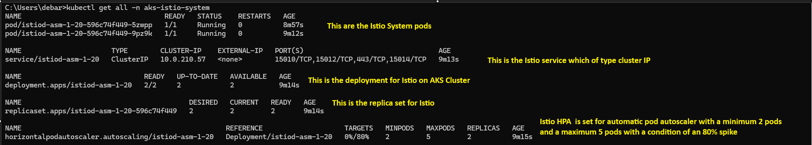
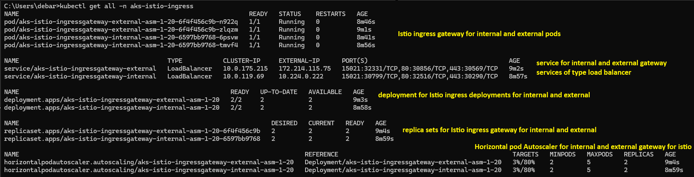
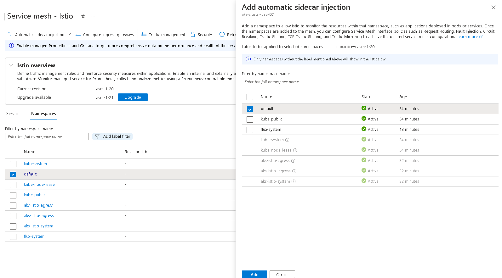

## Enable istio Service mesh on AKS Cluster
- az aks mesh enable --resource-group aks-cluster-deb-001_group --name aks-cluster-deb-001
- Istio sytem namespace components

- Istio Ingress namespace components
- Enabled automatic sidecar injection for default namespace